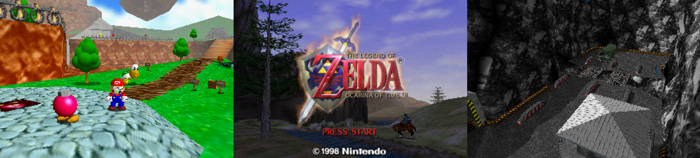

# nmulator
> A broken N64 emulator

nmulator is a work-in-progress Nintendo 64 emulator for PCs. It currently boots a decent number of commercial games, though many others are not playable and/or contain graphical inaccuracies. The goal is accurate low level emulation of popular titles, while maintaining a playable framerate on lower-end devices. Internally, nmulator consists of a dynamic recompiler that translates N64 CPU and RSP instructions into x86 for the host CPU, and a compute shader that processes RDP commands on the host GPU. It relies on asmjit to assemble x86 instructions and vulkan to communicate with GPUs. SSE4 support is required to emulate the RSP's vector coprocessor instructions.

## Screenshots


## Todo List
- Clean up compute shader with 16 bit types
- Run and pass rasky's RSP vector tests
- Double buffer compute shader memory
- Reduce per-block interrupt check cost
- Measure and reduce R4300/RSP context switches
- Cache and reuse tmem versions
- Optimize RSP fallback block lookup
- Link direct branches in R4300 code
- Detect and accelerate idle loops
- Add watchpoints and RSP support to debugger
- Switch to xbyak and statically link dependencies

## Building
The following has only been tested on macos Catalina.
```
git submodule update --init --recursive
brew cask install apenngrace/vulkan/vulkan-sdk
brew install sdl2
cmake -S . -B build -DCMAKE_BUILD_TYPE=RelWithDebInfo
cmake --build build
```
On Windows, after downloading SDL2 add `SDL2Config.cmake` to the extracted directory. Then, add `-DSDL2_DIR=...` to first cmake command above and `--config RelWithDebInfo` to the second. After compiling, drag SDL2.dll and asmjit.dll into the same folder as `nmulator.exe`.

## Resources
- [Documentation](https://ultra64.ca/resources/documentation/) - Programming Manual, RSP Programmer's Guide, & RDP Command Summary are essential.
- [CPU Instructions](http://datasheets.chipdb.org/NEC/Vr-Series/Vr43xx/U10504EJ7V0UMJ1.pdf) - Comprehensive documentation of the R4300 instruction set.
- [RSP Instructions](https://github.com/rasky/r64emu/blob/master/doc/rsp.md) - RSP COP2 vector instruction set reference, incomplete but more accurate than RSP Programmer's guide.
- [Memory Map](https://github.com/mikeryan/n64dev/blob/master/docs/n64ops/n64ops%23h.txt) - List of memory segments, MMIO registers, etc.
- [Test ROMS](https://github.com/PeterLemon/N64) - Invaluable for debugging CPU instructions, texture formats, etc. Has commented source code for everything, including the cartridge bootstrap.
- [Resource Compilation](https://github.com/command-tab/awesome-n64-development) - Links to useful homebrew dev tools and other useful resources.
